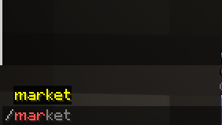
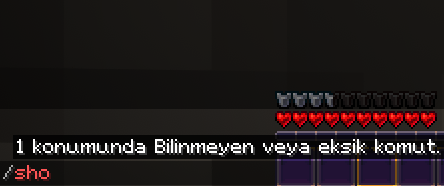
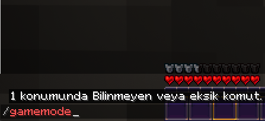
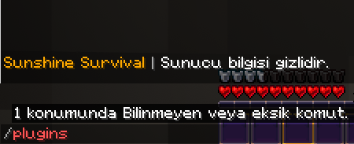

# SunshineCommandGuard

[](https://github.com/lordon1a/SunshineCommandGuard/releases/latest)
[](LICENSE)
[](https://github.com/lordon1a/SunshineCommandGuard/releases)
[](https://bstats.org/plugin/bukkit/SunshineCommandGuard/33904)

Hide commands from tab-complete, block their execution, and keep your plugin list private —
all scoped **per LuckPerms group**, with an admin tool that tells you exactly why any given
command is allowed or blocked before you ever flip the switch.

Most servers run dozens of plugins, and every one of them registers commands, sub-commands,
and namespaced aliases that regular players were never meant to see. `/plugins` hands out your
whole stack to anyone who asks. Tab-complete leaks every admin tool you have. SunshineCommandGuard
closes both doors without touching a single permission node you already have in LuckPerms.

## Table of contents

- [Features](#features)
- [Screenshots](#screenshots)
- [Requirements](#requirements)
- [Installation](#installation)
- [Configuration examples](#configuration-examples)
- [Commands and permissions](#commands-and-permissions)
- [Frequently asked questions](#frequently-asked-questions)
- [Compatibility](#compatibility)
- [Building from source](#building-from-source)
- [Metrics](#metrics)
- [License](#license)

## Features

- **Tab-complete filtering** via `PlayerCommandSendEvent` — players only see what they may use.
  The command doesn't just disappear from suggestions; the client never learns it exists.
- **Execution blocking** — a command the player may not run behaves as an unknown command,
  with a fully customizable message.
- **Server privacy** — hides `/plugins`, `/pl`, `/ver`, `/version`, `/about` and `/help` behind
  a message you write.
- **Per-group profiles** — groups resolved from LuckPerms permissions
  (`sunshine.cmdguard.group.<name>`), with `inherit` and `priority` so a `staff` group can
  extend `vip`, which extends `default`, without repeating a single line.
- **Flexible matching** — literal names, `regex:` patterns, negative `!entries` (deny always
  wins), and `plugin:<Name>` expansion to grab every command a plugin registers in one line.
- **Hidden aliases** — commands that stay fully runnable but disappear from tab-complete, for
  the aliases you don't want advertised but still need to work.
- **Argument-level rules** — per-command `args` allow/deny lists, e.g. let players use
  `/gamemode survival` but not `/gamemode creative`.
- **Live verification** — `/cmdguard test <player> <command>` prints the resolved group, the
  matching rule, and the reason a command is visible or blocked, before you enable anything.
- **One-command setup** — `/cmdguard generate` scans your live server and writes a reviewed
  starter config (`config.generated.yml`): commands nobody needs a permission for go to
  `default`, permission-gated ones to `staff`. Copy what you want into `config.yml`.
- **Permission-sync mode** — optionally also require each command's own Bukkit permission node,
  so players automatically lose commands their rank can't run, with zero list maintenance.
- **Temporary grants** — `/cmdguard grant <player> <command> <10m|2h|1d>` opens one command for
  a limited time (events, support cases), `/cmdguard ungrant` takes it back. No config edits.
- **Per-world groups** — restrict any group to specific worlds (`worlds: [arena]`), with the
  profile refreshing automatically on world change.
- **Block monitoring** — log every blocked attempt and/or ping online staff (throttled), so
  reconnaissance attempts don't go unnoticed.
- **Update checker + Folia support** — console notice when a new release is on Modrinth, and
  the same jar runs on Folia.
- **bStats metrics** included, relocated so it never conflicts with another plugin's copy.

## Screenshots

All four below are taken on a live production server, not a demo instance — the block and
privacy messages are that server's own text, fully customizable in `config.yml`.

| | |
| --- | --- |
|  **Allowed** — a whitelisted command completes normally. |  **Hidden** — not suggested, not even recognized by the client's own command tree — but still runs if typed out in full. |
|  **Blocked** — a command outside the group's list is invisible to the client and rejected as unknown. |  **Server privacy** — `/plugins` returns a custom message instead of the real plugin list. |

## Requirements

- Paper (or a Paper fork) **1.21.x**, Java **21**
- LuckPerms is **optional** (`softdepend`): without it, every player falls back to the
  `default` group.
- Players with the bypass permission or OP status skip all filtering — always test with a
  non-OP account.

## Installation

1. Drop `SunshineCommandGuard-1.1.0.jar` into your `plugins/` folder and start the server once
   (this creates the default `config.yml`).
2. Run `/cmdguard generate` and copy the useful parts of `config.generated.yml` into
   `config.yml` — or write your groups by hand.
3. Verify **before** enabling: `/cmdguard test <player> <command>`, with a non-OP test account.
4. Set `enabled: true`, then `/cmdguard reload`.

## ⚠️ Warning

A misconfigured filter can leave players with **no visible commands at all**. The plugin
therefore ships with `enabled: false`. Always review your groups and run `/cmdguard test` for
a default-group player **before** setting `enabled: true`.

## Configuration examples

Minimal — hide everything except a few commands:

```yaml
enabled: true
bypass-permission: "sunshine.cmdguard.bypass"
groups:
  default:
    priority: 0
    blocked-message: "<red>Unknown command."
    commands:
      - help
      - spawn
      - msg
      - "regex:^(msg|tell|w|r|reply)$"
      - "!op"
      - "!stop"
    hidden: []
    args: {}
```

Group-based access with inheritance:

```yaml
groups:
  default:
    priority: 0
    blocked-message: "<red>Unknown command."
    commands: [help, spawn, msg]
    hidden: []
    args: {}
  vip:
    priority: 10
    inherit: [default]
    commands: [hat, nick, workbench]
    hidden: [ecraft, ehat]
    args:
      gamemode:
        allow: [survival, creative]
        deny: []
  staff:
    priority: 50
    inherit: [vip]
    commands: ["plugin:WorldEdit"]
    hidden: []
    args: {}
```

Server privacy — replace `/plugins`, `/help`, and friends:

```yaml
privacy:
  plugins-command:
    enabled: true
    message: "<gold>My Server <grey>| <white>Server information is private."
    aliases: [plugins, pl, "bukkit:pl", "bukkit:plugins", ver, version, about, icanhasbukkit]
  help-command:
    enabled: true
    message: "<yellow>Type <white>/help <yellow>for a list of commands."
    aliases: ["?", "bukkit:help", "minecraft:help"]
```

**Matching rules:** entries are matched case-insensitively, with or without a leading `/`, and
namespaced labels (`essentials:heal`) also match their base name (`heal`). `!entry` denies (deny
always wins over any allow), `regex:<pattern>` allows full-match patterns, `plugin:<Name>`
expands to every command that plugin registers. `hidden` entries are runnable but never
suggested in tab-complete — use them for aliases you don't want advertised.

Optional top-level modes (all backward compatible — old configs load unchanged):

```yaml
# Also require each command's own Bukkit permission node.
permission-sync: false

monitoring:
  log-blocked: false        # log every blocked attempt to console
  notify-staff: false       # message online staff on blocked attempts
  notify-permission: "sunshine.cmdguard.notify"
  notify-cooldown-seconds: 5  # per-player throttle

update-checker:
  enabled: true
  modrinth-id: ""           # fill in after publishing; empty = no check
```

Per-world groups — a group with `worlds` only matches there (empty = everywhere).
If `default` itself is world-restricted you get a config warning, because players outside
those worlds would be unfiltered:

```yaml
groups:
  minigames:
    priority: 20
    inherit: [default]
    commands: [queue, leave, spectate]
    hidden: []
    args: {}
    worlds: [arena, lobby]
```

## Commands and permissions

| Command | Permission | Description |
| --- | --- | --- |
| `/cmdguard reload` | `sunshine.cmdguard.admin` | Reload config, rebuild index, clear caches |
| `/cmdguard refresh <player>` | `sunshine.cmdguard.admin` | Drop one player's cache, resend command tree |
| `/cmdguard test <player> <command>` | `sunshine.cmdguard.admin` | Show groups, visibility, reason for a command |
| `/cmdguard debug` | `sunshine.cmdguard.admin` | Suspend/resume filtering at runtime (no config write) |
| `/cmdguard dump` | `sunshine.cmdguard.admin` | Write all registered commands to `commands_dump.yml` |
| `/cmdguard generate` | `sunshine.cmdguard.admin` | Write a review-ready starter config to `config.generated.yml` |
| `/cmdguard grant <player> <command> <30s\|10m\|2h\|1d>` | `sunshine.cmdguard.admin` | Temporarily allow one command (memory-only, lost on restart) |
| `/cmdguard ungrant <player> [command]` | `sunshine.cmdguard.admin` | Revoke one or all temporary grants |

| Permission | Default | Description |
| --- | --- | --- |
| `sunshine.cmdguard.bypass` | op | Bypasses all command filtering |
| `sunshine.cmdguard.admin` | op | Allows use of `/cmdguard` |
| `sunshine.cmdguard.notify` | op | Receives blocked-command staff notifications |
| `sunshine.cmdguard.group.<name>` | — | Assigns a player to group `<name>` (via LuckPerms) |

## Frequently asked questions

**Does this replace LuckPerms?** No. LuckPerms still controls what a player is *allowed* to
run. SunshineCommandGuard controls what a player *sees* and what happens when they try
something outside their group — a permission system and a visibility filter are different
problems, and this plugin only solves the second one.

**Will OPs and admins be affected?** No, by design — `sunshine.cmdguard.bypass` defaults to
`op`, so operators always see and can run everything. Test with a real non-OP account, or the
filter will look broken when it's actually just not being applied to you.

**What happens to a hidden command if a player already knows it?** It still runs. `hidden`
only removes a command from tab-complete suggestions; it's a different list from `commands`,
which controls whether the command runs at all. Use `hidden` for aliases you don't want to
advertise, and the plain block list for commands you actually want to deny.

**Does this affect server performance?** Filtering runs on join and on `/cmdguard reload`, not
on every keystroke — the client's command tree is rebuilt once per player, not recomputed for
every tab press.

**Can I use this without LuckPerms?** Yes. LuckPerms is a soft dependency; without it every
player resolves to the `default` group.

## Compatibility

Built against the **Paper 1.21.4 API (Java 21)**. Tested on a clean Paper 26.2 server (v1.1.0:
clean enable, `groups=3 warnings=0`) and running in production on Paper 26.2. The same jar
runs on **Folia**. Older/newer server versions are untested — please open an issue with what
works or doesn't on your setup.

## Building from source

```powershell
.\gradlew.bat build   # needs JDK 21, output: build/libs/SunshineCommandGuard-1.1.0.jar
.\gradlew.bat test    # 65 unit tests (JUnit 5)
```

The uploaded jar must be the `shadowJar` output (`build/libs/...`), which bundles bStats
(relocated to `com.sunshine.cmdguard.bstats` so it never conflicts with other plugins).
`build.ps1` remains as a fast local-compile script for the original author's machine.

## Metrics

This plugin collects anonymous usage statistics via [bStats](https://bstats.org/plugin/bukkit/SunshineCommandGuard/33904).
Server owners can opt out in `plugins/bStats/config.yml`.

## Keywords

command hide, tab complete, plugin hide, pl hide, command blocker, permissions, luckperms

## License

GPL-3.0 — see [LICENSE](LICENSE). Derivative works must stay open source.

Issues and pull requests are welcome.
